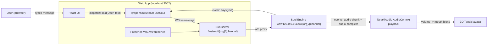
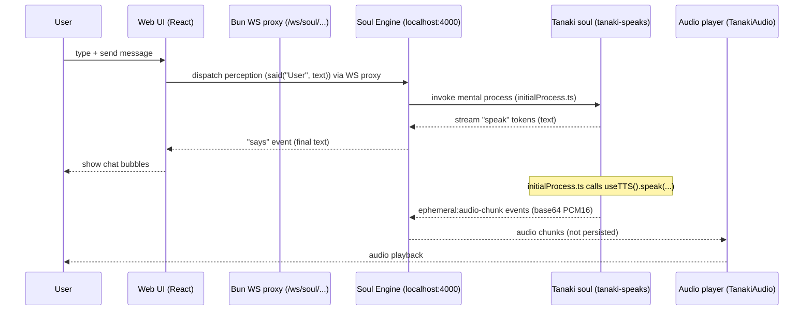
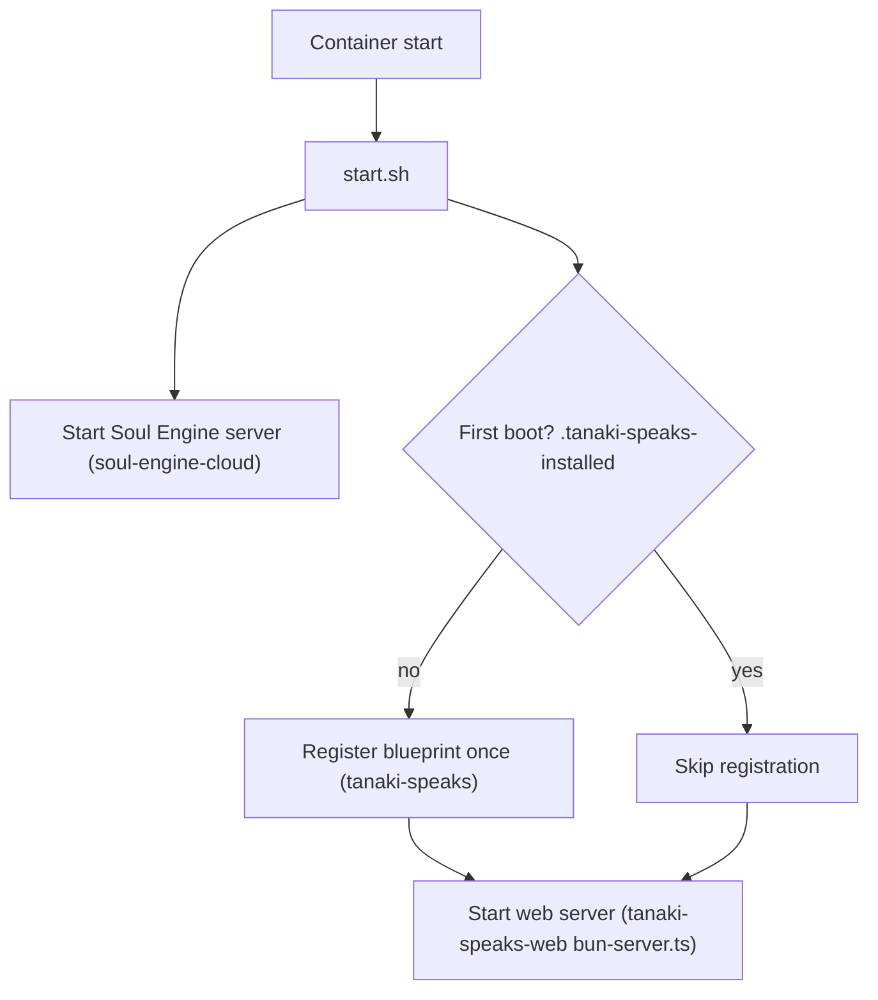

# Tanaki

The original Open Soul.

Tanaki is a playful animated noodle living on a web page. Visitors type messages, and Tanaki responds out loud through a wiggly noodle mouth. He’s a friendly “spirit of creativity” who hosts the vibe (even with multiple people chatting at once), speaking to encourage kindness, creativity, and collaboration.

Tanaki is a conversational AI soul (personality + cognition) running on the OpenSouls Soul Engine, with a web frontend that renders a 3D Tanaki avatar and plays real-time TTS audio.

If you want to learn the Soul Engine itself, start here: [opensouls/opensouls](https://github.com/opensouls/opensouls).

### Quickstart (run from scratch)

**Prereqs**
- **Bun**: install from [bun.sh](https://bun.sh)

**0) Clone and initialize the submodules**

```bash
git clone https://github.com/opensouls/tanaki
cd tanaki
git submodule init
git submodule update
```

**1) Install workspace deps**

```bash
bun install
```

**2) One-time setup for the Soul Engine services**

This repo vendors `opensouls/` as a workspace. Run the setup script once (it configures the engine workspace; you may be prompted for keys depending on your setup):

```bash
bun run setup
```

**3) Start the Soul Engine services (UI + cloud + docs)**

```bash
bun run start
```

- Docs usually come up on `http://localhost:3001` (see `opensouls/README.md`).

**4) Start Tanaki’s soul (the blueprint)**

In a new terminal:

```bash
cd packages/tanaki-speaks
bunx soul-engine dev
```

This runs the **`tanaki-speaks`** blueprint against your local Soul Engine.

**5) Start the web app**

In a new terminal:

```bash
cd packages/tanaki-speaks-web
bun dev
```

Open the site at `http://localhost:3002`.

---

### Where Tanaki’s personality comes from (`packages/tanaki-speaks`)

Tanaki’s “who am I?” mainly comes from **static memories** loaded by the soul definition:

- **Core personality + scene**: `packages/tanaki-speaks/soul/staticMemories/core.md`
- **Loaded into the soul**: `packages/tanaki-speaks/soul/soul.ts` (via `staticMemories.core = load("./staticMemories/core.md")`)

Tanaki’s behavior loop is implemented in:

- **Main mental process**: `packages/tanaki-speaks/soul/initialProcess.ts`
  - Batches messages, adapts instructions for 1:1 vs group chat, generates dialog, and triggers TTS.
- **Cognitive steps**: `packages/tanaki-speaks/soul/cognitiveSteps/`

If you want to change Tanaki’s vibe quickly, edit `core.md` and save—when running `bunx soul-engine dev`, changes sync immediately.

---

### How the web app hooks up (`packages/tanaki-speaks-web`)

The web app talks to the Soul Engine over WebSockets, and the 3D avatar + audio playback are driven by events coming back from the soul.

#### High-level architecture



#### Message + audio flow (what happens when you press “send”)



#### The key integration points in code

- **WebSocket URL + provider**: `packages/tanaki-speaks-web/src/components/TanakiClient.tsx`
  - Wraps the app in `SoulEngineProvider`.
  - Forces same-origin WS via `/ws/soul/:org/:channel` (so this works both locally and on Fly).
- **Soul connection + chat dispatch**: `packages/tanaki-speaks-web/src/hooks/useTanakiSoul.ts`
  - `useSoul({ blueprint: "tanaki-speaks", soulId: "tanaki-shared-session", debug: true, ... })`
  - Sends user text as a perception with `said("User", text)`.
  - Adds `_metadata.connectedUsers` so Tanaki can adapt to group chat.
- **WS proxy + presence**: `packages/tanaki-speaks-web/bun-server.ts`
  - `/ws/soul/:org/:channel` → proxies to `ws://127.0.0.1:4000/:org/:channel`
  - `/ws/presence` → tracks connected users for “group hangout” behavior.
- **TTS audio**: `packages/tanaki-speaks/soul/initialProcess.ts` + `packages/tanaki-speaks-web/src/components/TanakiClient.tsx`
  - The soul emits **ephemeral** audio events (chunks) while speaking.
  - The web app plays PCM16 in real-time and uses volume to drive mouth animation.

---

### Ports & endpoints (local dev)

| Component | Default | Notes |
| --- | ---: | --- |
| Web app (Bun server) | `:3002` | `bun dev` in `packages/tanaki-speaks-web` |
| Web app (Vite dev server) | `:5173` | Proxied behind `:3002` in dev |
| Soul Engine WS | `:4000` | Bun server proxies `/ws/soul/...` → here |
| Soul Engine docs | `:3001` | Started by `bun run start` (see `opensouls/README.md`) |

---

### Deploying on Fly.io (`fly.toml` + `Dockerfile`)

This repo is set up to deploy a **single container** to Fly that runs:
- The **Soul Engine** (internal-only, listens on `127.0.0.1:4000`)
- The **Tanaki web server** (public, listens on `0.0.0.0:3002`)
- A **Prometheus metrics** server (scraped by Fly, listens on `0.0.0.0:9091`)

#### What `fly.toml` does

- **Build**: uses the repo `Dockerfile`
- **Public HTTP**: routes Fly traffic to `internal_port = 3002`
- **Metrics**: scrapes `http://<machine>:9091/metrics`

See: `fly.toml`

#### What the `Dockerfile` does

`Dockerfile` is a multi-stage Bun build that:
- Installs workspace deps (including `opensouls/` packages)
- Builds the web app (`packages/tanaki-speaks-web`)
- Generates Prisma client for the engine (`opensouls/packages/soul-engine-cloud`)
- Warms the HuggingFace embedding model cache into `HF_HOME` (so first boot is faster)

At runtime it executes `packages/tanaki-speaks-web/start.sh`.

#### Runtime boot flow (`start.sh`)



The web server (`packages/tanaki-speaks-web/bun-server.ts`) proxies browser websocket connections from:
- `/ws/soul/{org}/{channel}` → `ws://127.0.0.1:4000/{org}/{channel}`

So on Fly the Soul Engine does **not** need to be publicly exposed; it stays inside the same container.

#### Required secrets

At minimum, TTS requires:

```bash
fly secrets set OPENAI_API_KEY=...
```

#### Persistence note (recommended)

The container stores pglite + blueprint install markers under `CODE_PATH` (defaults to `/app/data`) and pglite under `PGLITE_DATA_DIR` (defaults to `/app/data/pglite`) via `packages/tanaki-speaks-web/start.sh`.

If you want conversations/state to survive deploys and machine restarts, mount a Fly volume to `/app/data` (otherwise it’s ephemeral).

---

### Learn more

- **OpenSouls engine + docs + examples**: [opensouls/opensouls](https://github.com/opensouls/opensouls)
