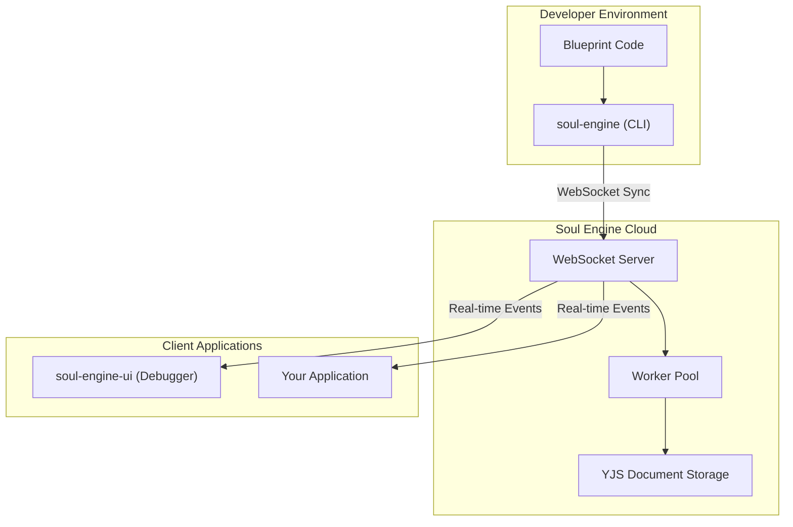
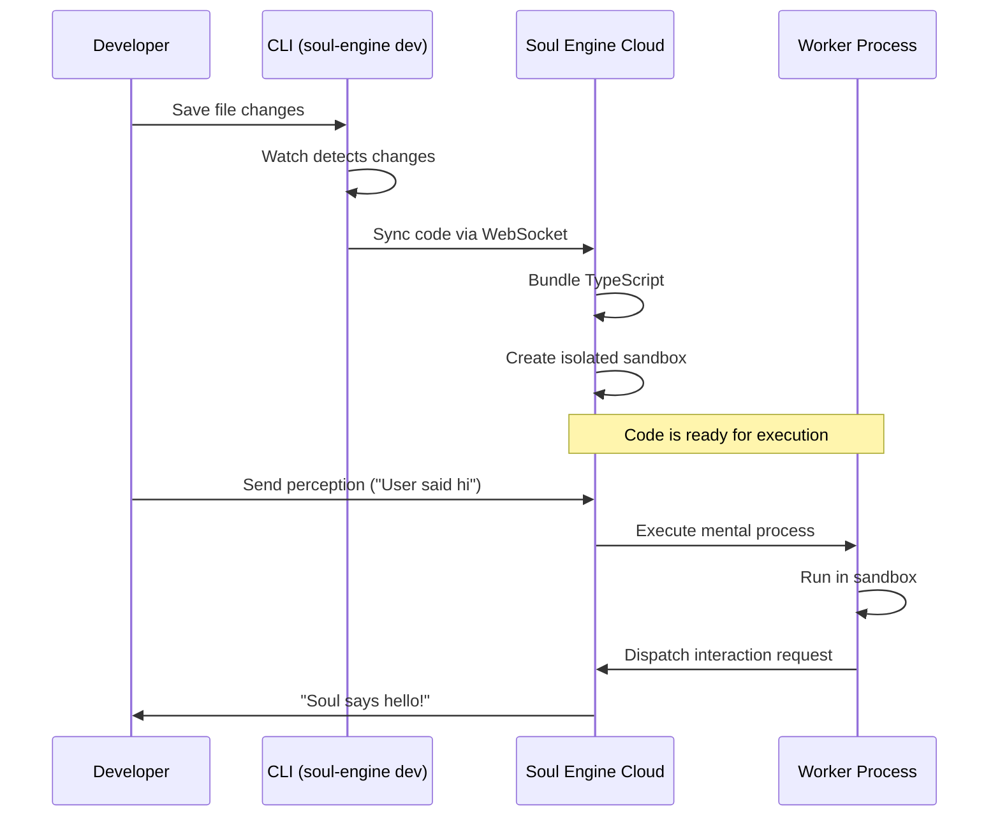
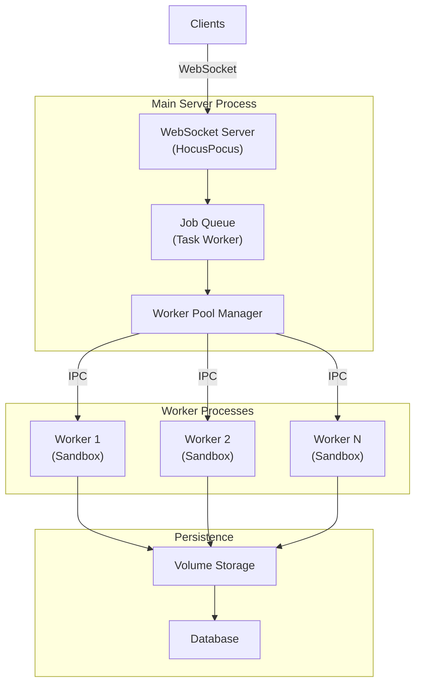
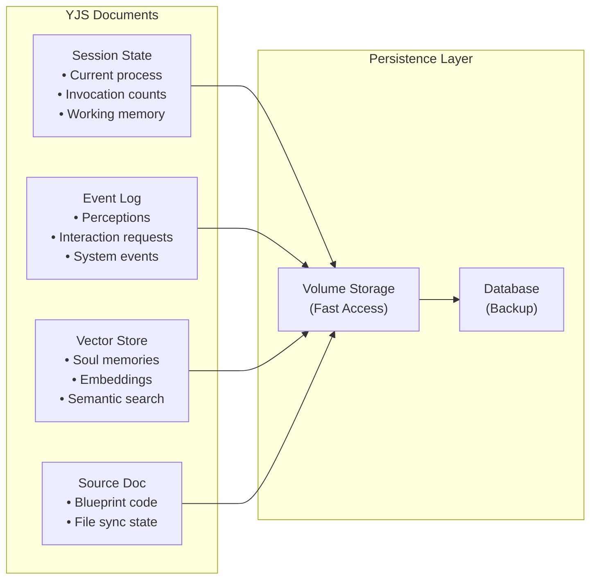
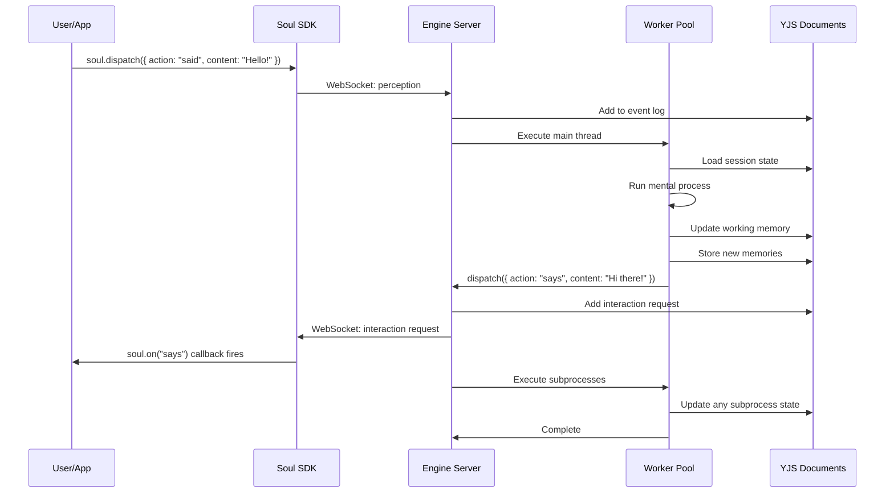

# Soul Engine Architecture

The Soul Engine is a distributed system for creating, deploying, and running AI souls. This document provides a high-level overview of how code flows from your local development environment to execution on the engine, and how state and memories are persisted.

## Package Overview

The Soul Engine is organized into several key packages:



| Package | Purpose |
|---------|---------|
| `packages/soul-engine-cloud` | The main engine that compiles and executes soul code in isolated sandboxes |
| `packages/soul-engine` | CLI tooling (`bunx soul-engine dev`) that watches your code and syncs it to the engine |
| `packages/soul-engine-ui` | Next.js debugger UI for testing and inspecting souls in real-time |
| `packages/engine` | Core SDK with types, client libraries, and the `Soul` class for connecting to souls |

---

## Code Flow: From Developer to Execution

When you're developing a soul, your code takes the following journey from your editor to execution:



### Step by Step

1. **Write Code Locally**  
   You write your blueprint in a local directory—mental processes, subprocesses, the soul's personality markdown file, and any cognitive steps.

2. **CLI Syncs to Engine**  
   Running `bunx soul-engine dev` starts a watcher that detects file changes and syncs your code to the Soul Engine over a WebSocket connection. The code is stored in a YJS document for real-time collaboration.

3. **Engine Bundles & Sandboxes**  
   The engine bundles your TypeScript using Bun and prepares it for execution in an isolated sandbox. This sandbox prevents your code from accessing system resources or interfering with other souls.

4. **Perceptions Trigger Execution**  
   When a perception arrives (e.g., a user message), the engine adds it to working memory and executes your current mental process. Your code runs, potentially calling LLMs, updating memories, and dispatching interaction requests.

5. **Interaction Requests Flow Back**  
   When your soul calls `dispatch()` or `speak()`, the engine sends an interaction request back to connected clients over the WebSocket, completing the loop.

---

## Server & Worker Architecture

The Soul Engine uses a multi-process architecture to safely execute user code while maintaining real-time responsiveness:



### Key Components

**WebSocket Server**  
Built on HocusPocus, the server maintains persistent WebSocket connections with clients. It handles document synchronization, authentication, and routes perceptions to the processing queue.

**Worker Pool**  
A pool of child processes (typically 2-5) that execute user code in isolation. Each worker:
- Runs in its own process for memory isolation
- Communicates with the main server via IPC (Inter-Process Communication)
- Can be killed and respawned if code misbehaves
- Maintains its own database connection for efficiency

**Job Queue**  
A task queue manages work distribution:
- Processing perceptions through mental processes
- Executing subprocesses after the main thread completes
- Handling scheduled events (e.g., "remind me in 5 minutes")
- Code sync and bundling tasks

**Processing Flow**  
When a perception arrives:
1. Server adds it to the event log
2. Job queue schedules main thread execution
3. Worker pool assigns an available worker
4. Worker executes the mental process in a sandbox
5. Worker reports completion; server schedules subprocesses
6. Subprocesses run, then the cycle completes

---

## Memory & State (YJS Documents)

All soul state is stored in **YJS documents**—conflict-free replicated data types (CRDTs) that enable real-time synchronization across multiple clients without conflicts.



### Document Types

| Document | Contents |
|----------|----------|
| **Session State** | Current mental process, invocation counts, working memory, subprocess states |
| **Event Log** | All perceptions, interaction requests, and system events with timestamps |
| **Vector Store** | Soul memories with embeddings for semantic search |
| **Source Doc** | Synchronized blueprint code from the CLI |

### Memory Hooks

Your soul code interacts with memory through hooks:

**`useSoulMemory(key, initialValue)`**  
Persistent key-value storage that survives across sessions. Perfect for remembering facts, preferences, or any structured data.

```typescript
const name = useSoulMemory("userName", "")
// Later...
name.current = "Alice"  // Persisted automatically
```

**`useSoulStore()`**  
A vector store with embedding-based semantic search. Store and retrieve memories by meaning, not just keys.

```typescript
const { set, search } = useSoulStore()

// Store a memory with metadata
set("memory-1", "User loves jazz music", { topic: "preferences" })

// Search by semantic similarity
const results = await search("what kind of music?", { limit: 5 })
```

### Why YJS?

YJS provides several benefits for soul state:

- **Real-time Sync**: Changes propagate instantly to the debugger UI and any connected clients
- **Conflict Resolution**: Multiple writers (main thread, subprocesses, UI) can update state without conflicts
- **Offline Support**: State can be modified offline and merged when reconnected
- **Versioning**: Easy to snapshot and revert to previous states (used by the debugger's "revert" feature)
- **Efficient**: Binary encoding and delta updates minimize network traffic

---

## Putting It All Together

Here's how all the pieces connect when a user interacts with your soul:



The Soul Engine handles all the complexity of:
- Secure code execution in isolated sandboxes
- Real-time state synchronization
- Persistent memory with semantic search
- Multi-process job management
- WebSocket communication

You focus on designing your soul's mind—the engine handles the rest.
