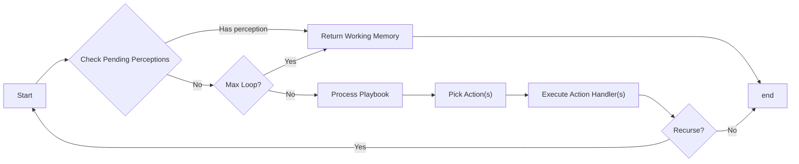

# Implicit Semantic Machine

While [Cognitive Steps](/core/cognitive-step) are excellent tools for individual tasks, and [Mental Processes](/blueprints/mental-processes) are excellent for "state-machine"-esque processes where you want granular control over your soul's processing cycle, **Implicit Semantic Machines** (ISMs) are a newer, advanced paradigm for programming complex behaviors for any given Soul.

ISMs work by providing a **goal** which is what the Soul is trying to achieve, a **playbook** by which to ground and guide the Soul's decision process, and **actions** that the Soul can choose to take.
 
## Differences

One of the high level differences to understand around ISMs compared to regular Mental Processes is the Soul's ability to choose. In a Mental Process, a Soul only has the choice that you develop for it. If a Mental Process thinks with an `internalMonologue` Cognitive Step and then decides with a `decicion` Cognitive Step, the Soul can't ever deviate from that flow.

ISMs however, provide a way to still control functionality, while giving the execution and logic choice back to the Soul. This choice, however, can potentially come with increased execution time due to the fact that the Soul has to make additional calls to think, pick, execute, and potentially recurse. ISMs are a powerful tool, but they do not need to be used for everything.

## Structure of ISMs
Here is a generic representation of how an ISM executes



On execution, the ISM works by creating a memory region with the provided playbook and setting up the internal memory for the ISM. The internal memory helps keep the Soul focused on the task, and keeps a running log of decisions that the Soul has made in the ISM to help prevent it from getting stuck in action loops, or trying to repeatedly pick the same action.

When executing actions, ISMs will recursively run until your Soul has satisfied the provided goal, if the maximum loops have been reached, or until an Action specifies a new Mental Process to run.

## Creating an ISM

To create a new ISM, assuming you have copied over the base ISM functionality (similarly to how we copy over existing Cognitive Steps), you simply need to import the ISM, and create your functionality. At a minimum, an ISM needs a **goal**, a **playbook**, and at least one **action**. 

It is important that the goal and playbook are clear and concise, as they are what are used to guide the Soul toward a desired output. 

```typescript filename="ism/exampleISM.ts"
import { implicitSemanticMachine } from "./cognitiveFunctions/implicitSemanticMachine"

constexampleISM = await implicitSemanticMachine({
  workingMemory,
  internalMemory: workingMemory,
  goal: "Understand the problem the User has, and help the User solve a problem",
  actions,
  playbook: "Solve the User's problem",
})
```

## Actions

Actions are similar to [Tool Use](/blueprints/hooks/useTool) in the fact that they allow your Soul to choose what Action they want to execute. From a functionality perspective, Actions perform more like discrete Mental Process, running some cognitive steps, editing some working memory, and returning for the next cycle. An action consists of a **name**, **description**, a `handleActionUse` handler, and takes the following basic shape:

```typescript
import { Action } from "./cognitiveFunctions/implicitSemanticMachine"

const actions:Action[] = [
  {
    name: "Reset",
    description: `Reset the soul back to the initial process`,
    handleActionUse: async (workingMemory, internalMemory, recurse) => {
      return [workingMemory, initialProcess, { executeNow: true }];
    }
  }
]
```

it's important to ensure that the **name** and **description** are concise and descriptive, as they will be used by the ISM in order to decide what action to take in order to complete the given goal. This is done through the `pickAction` cognitive step in the ISM code. You'll likely need to adjust your action descriptions based on your ISM use case, and what model you are using to choose actions.

### Using Recursive Actions

Actions are not limited to simply selecting the next Mental Process. Actions also get passed a `recurse` function, that will call the ISM, and continue iterating. This can be done as follows:

```typescript {5,11-14}
import { Action } from "./cognitiveFunctions/implicitSemanticMachine"

const actions:Action[] = [
  {
    name: "Think",
    description: "Think about the problem being asked",
    handleActionUse: async (workingMemory, internalMemory, recurse) => {
      const [withThought, thought] = await internalMonologue(
        workingMemory,
        `Think about the problem being asked and access knowledge necessary to better answer it.`,
      );

      return recurse({
        workingMemory: withThought,
        internalMemory: withThought,
      })
    }
  }
]
```

