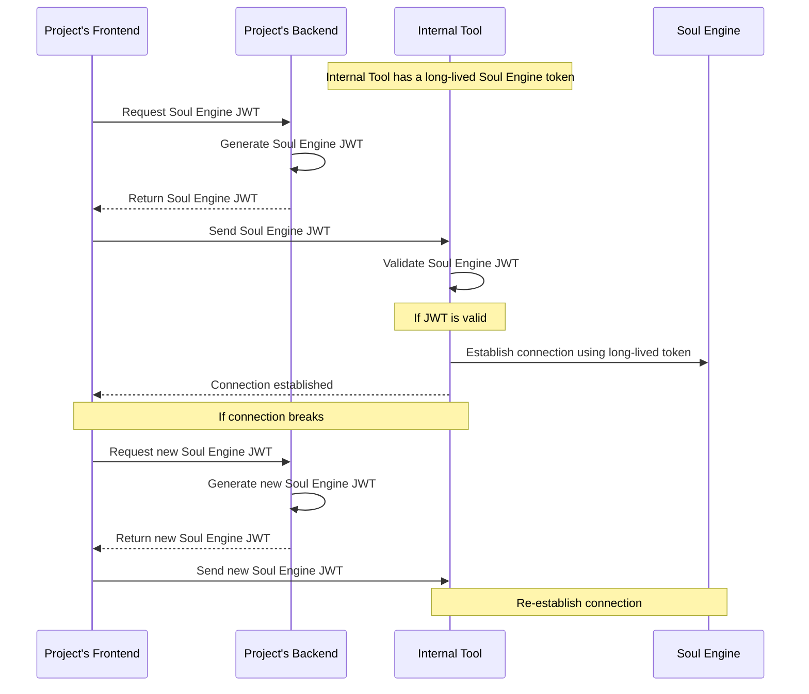

import { Callout } from 'nextra/components'

# Internal tool JWT

Internal tools have long-lived JWT tokens that are used to authenticate requests to the Soul Engine:



## Setting up a new internal tool

To set up a new internal tool with JWT authentication, follow these steps:

### 1. Get or create a key pair

#### In production:

Retrieve the internal tool key pair from 1Password. Save both keys to your `.env` file.

#### In development:

Run the following command in the `packages/soul-engine-cloud` directory:

```bash
bun run jwt create-key-pair
```

This will generate a new key pair. Save both keys to your `.env` file.

### 2. Create a long-lived token

Run the following command in the `packages/soul-engine-cloud` directory:

```bash
bun run jwt create-long-lived-token
```

This will generate a long-lived JWT token using the private key you saved to your `.env` file. Save this token in the internal tool's `.env` file as instructed.

### 3. Implement the authentication flow in your internal tool

Validate the JWT token you're receiving from the client and then connect to the Soul Engine using the long-lived token. Check out the voice server implementation for an example of how to do this.

