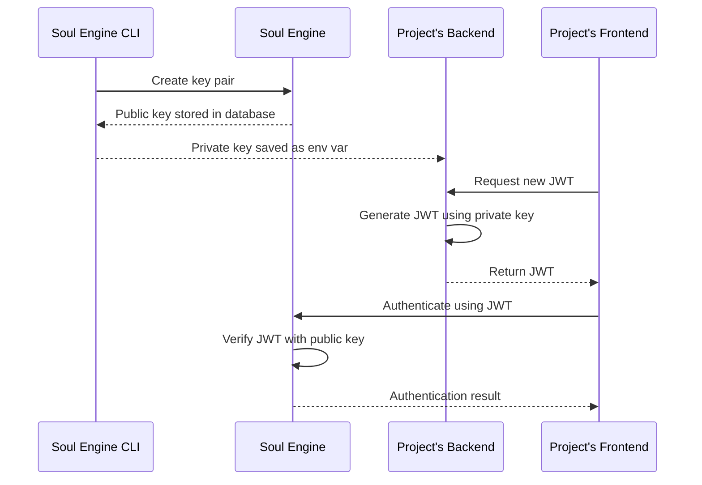

import { Callout } from 'nextra/components'

# JWT Authentication

To securely authenticate a frontend client with the Soul Engine without exposing your API key, you can use JWT authentication.

## How it works

The JWT authentication process involves several steps between the client, server, and Soul Engine:

1. A new key pair is created via the Soul Engine CLI.
2. The public key is stored in the Soul Engine database.
3. The private key is displayed in the terminal so it can be saved as an environment variable on the project's backend.
4. The project's frontend communicates with the project's backend to request a new JWT.
5. The backend uses the private key to generate a JWT.
6. The frontend authenticates with the Soul Engine using the JWT.
7. The Soul Engine verifies the JWT using the stored public key.
8. The authentication result is returned to the client.



## Setting up JWT authentication in a project

### 1. Create a new key pair

To create a key pair, run the following command:

```bash
bunx soul-engine jwts create --issuer <issuer>
```

The `issuer` is a unique identifier for your project. Choose something specific to your application, like its name or a domain (e.g., `discord-onboarding-soul` or `zombo.com`). The Soul Engine uses this information to find the correct JWT public key for your project and correctly verify your JWTs.

### 2. Save the private key as an environment variable

The private key is displayed in the terminal. It should be saved as an environment variable on the project's backend. We do not store this private key. If it is lost, you'll have to regenerate a new key.

<Callout emoji="⚠️">
Make sure the project's frontend does NOT have access to this secret.
</Callout>

### 3. Add an authentication endpoint to your backend

Add an endpoint to your backend that the frontend calls to get a new JWT.

Here's an example using Express and Node.js:

```typescript
import express from 'express';
import { issueTokenForEngine } from "@opensouls/soul";

const app = express();

app.post('/auth/token', async (req, res) => {
  try {
    const token = await issueTokenForEngine({
      privateKey: process.env.SOUL_ENGINE_JWT_PRIVATE_KEY,
      issuer: process.env.SOUL_ENGINE_JWT_ISSUER,
      organization: process.env.SOUL_ENGINE_ORGANIZATION,
      blueprint: process.env.SOUL_ENGINE_BLUEPRINT,
      soulId: req.body.soulId,
    });

    res.json({ token });
  } catch (error) {
    console.error('Error generating token:', error);
    res.status(500).json({ error: 'Failed to generate token' });
  }
});

const PORT = 3000;
app.listen(PORT, () => {
  console.log(`Server is running on port ${PORT}`);
});
```

### 4. Connect your frontend to the Soul Engine

Send a callback function as the `token` parameter to the `Soul` constructor. This function will be automatically called to refresh the JWT when necessary.

```typescript
async function createToken(soulId: string) => {
  const response = await fetch(`/auth/token`, {
    method: 'POST',
    body: JSON.stringify({ soulId }),
  });
  const data = await response.json();
  return data.token;
}

// ...

const soul = new Soul({
  blueprint,
  organization,
  soulId,
  // this has to be a function so the token can be auto-refreshed
  token: () => createToken(soulId),
})
```
